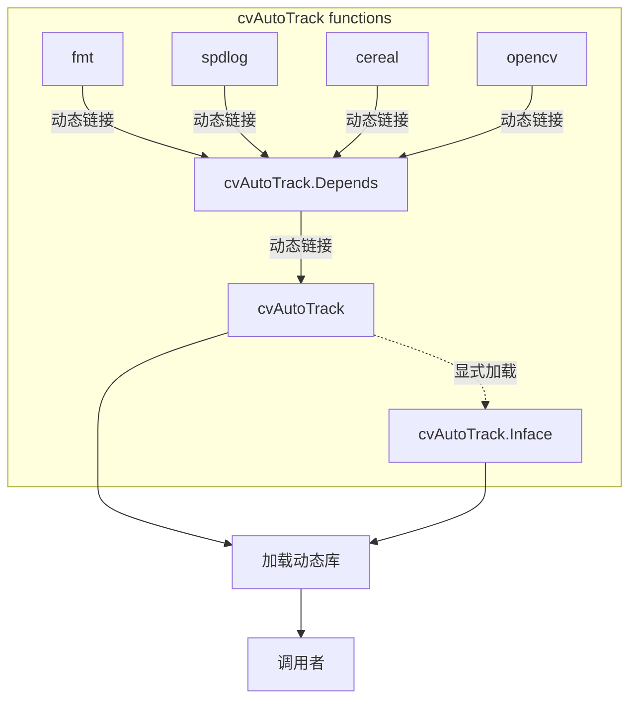

# cvAutoTrack.Inface

```mermaid
flowchart TD
    subgraph cvAutoTrack functions
        Base[cvAutoTrack] -.->| 显式加载 | Inface[cvAutoTrack.Inface]
        Deps[cvAutoTrack.Depends] -->| 动态链接 | Base
        fmt -->| 动态链接 | Deps
        spdlog -->| 动态链接 | Deps
        cereal -->| 动态链接 | Deps
        opencv -->| 动态链接 | Deps
    end
    Base -->   load[加载动态库]
    Inface --> load[加载动态库]
    load --> world[调用者]
```