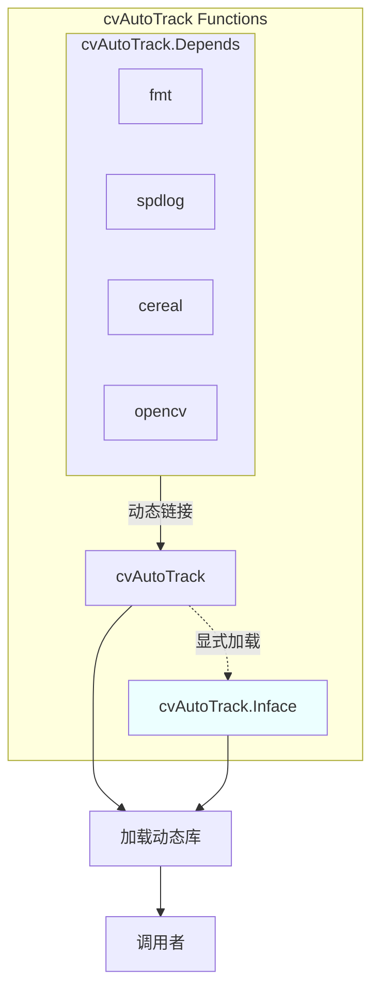

# cvAutoTrack.Inface

```mermaid
flowchart TD
    subgraph cvAutoTrack Functions
        subgraph cvAutoTrack.Depends
            fmt[fmt]
            spdlog[spdlog]
            cereal[cereal]
            opencv[opencv]
        end    
        cvAutoTrack.Depends -->| 动态链接 | Base
        Base[cvAutoTrack] -.->| 显式加载 | Inface[cvAutoTrack.Inface]
        classDef color fill:#ececff;
        class cvAutoTrack.Depends color
        classDef border_color fill:#ecffff;
        class Inface border_color
    end
    Base -->   load[加载动态库]
    Inface --> load[加载动态库]
    load --> world[调用者]
```
### 推行计划

- [ ] 实现静态链接版本的cvAutoTrack的inface调用
- [ ] 实现动态链接版本的cvAutoTrack的inface调用
- [ ] 实现动态链接版本的cvAutoTrack热更新inface调用