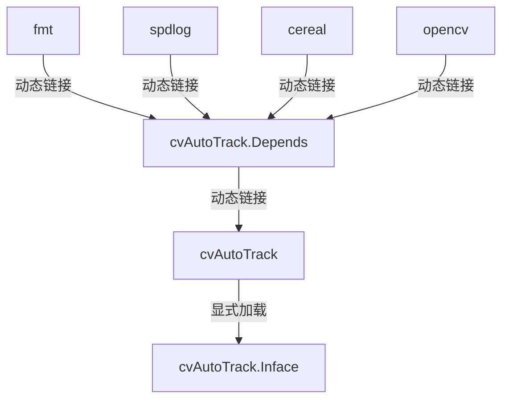

# cvAutoTrack.Inface

```mermaid
flowchart TD
    Base[cvAutoTrack] -->| 显式加载 | Inface[cvAutoTrack.Inface]
    Deps[cvAutoTrack.Depends] -->| 动态链接 | Base
    fmt -->| 动态链接 | Deps
    spdlog -->| 动态链接 | Deps
    cereal -->| 动态链接 | Deps
    opencv -->| 动态链接 | Deps
```